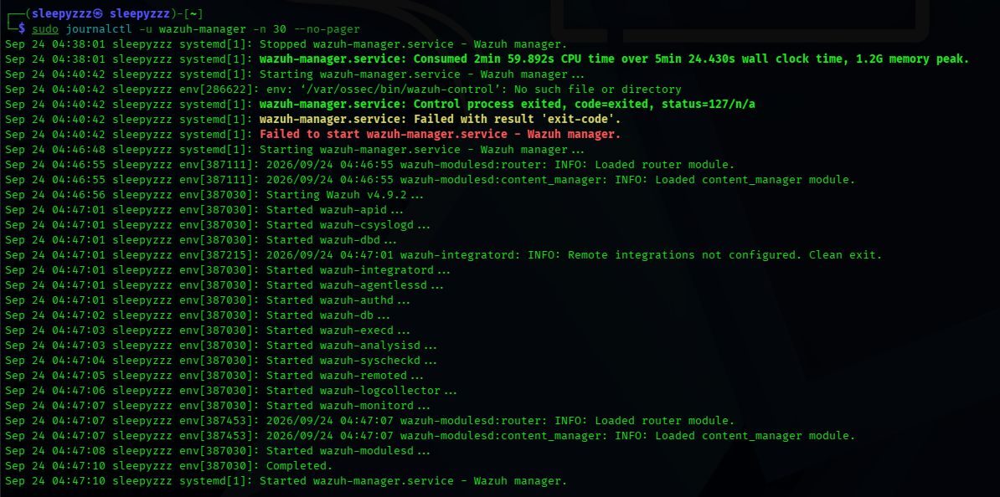
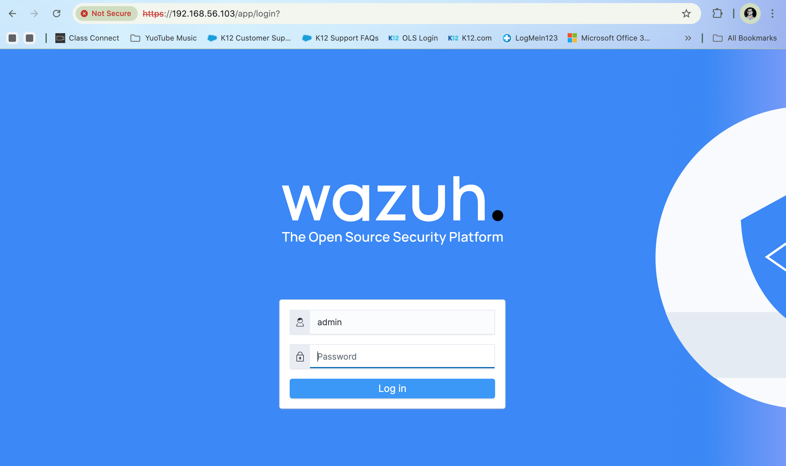
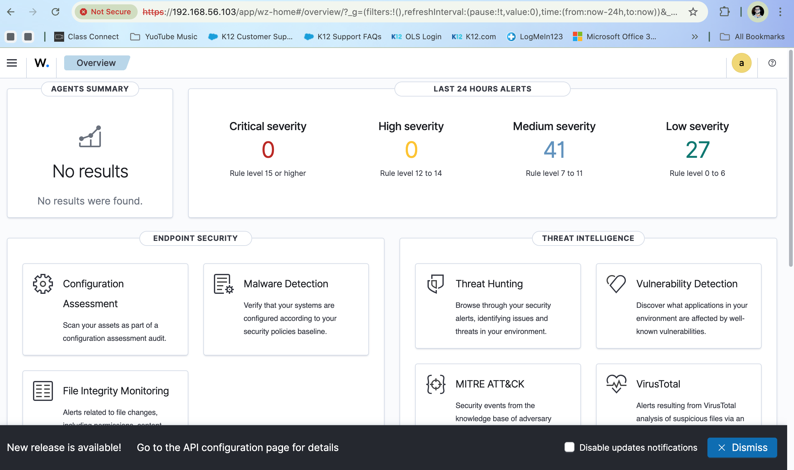

# Wazuh SIEM Lab

## Обзор проекта
Развернул Wazuh SIEM (Security Information and Event Management) с нуля на Kali Linux. Настроил сбор логов, генерацию сертификатов, и получил доступ к веб-интерфейсу Wazuh Dashboard.

## Что я сделал
- Установил Wazuh 4.9.2 (Indexer, Manager, Dashboard)
- Настроил Host-Only сеть между Kali и Mac
- Сгенерировал и проверил SSL-сертификаты
- Настроил прослушивание портов 443 и 9200
- Успешно вошёл в Wazuh Dashboard

## Инструменты
- Kali Linux
- Wazuh 4.9.2
- OpenSearch (в составе Wazuh)
- VirtualBox (Host-Only networking)

---

## 1. Проверка сети

[Проверка сети](01-network-verification.png)

*Настройка и проверка сетевого подключения. Интерфейс `eth0` получил IP `10.0.2.15`. Проверка связи с `8.8.8.8` и `google.com` — 0% потерь.*

---

## 2. Установка зависимостей

[Установка зависимостей](02-prerequisites-installed.png)

*Обновление списка пакетов и установка зависимостей (`curl`, `wget`, `gnupg`, `apt-transport-https`).*

---

## 3. Загрузка установщика Wazuh

[Загрузка установщика](03-wazuh-installer-downloaded.png)

*Загрузка официального установщика Wazuh 4.9.2.*

---

## 4. Установка Wazuh 4.9.2

[Установка Wazuh](04-wazuh-installation.png)

*Запуск установки Wazuh 4.9.2 через официальный установщик.*

---

## 5. Проверка служб Wazuh

[Службы Wazuh](05-wazuh-services-running.png)

*Проверка запущенных служб. Wazuh Indexer, Wazuh Manager и Filebeat активны.*

---

## 6. Запуск Wazuh Dashboard

[Wazuh Dashboard](06-wazuh-dashboard-running.png)

*Служба Wazuh Dashboard включена и активна.*

---

## 7. Настройка Host-Only сети

[Host-Only IP](07-eth1-host-only-ip.png)

*Интерфейс `eth1` получил IP `192.168.56.103` через DHCP.*

---

## 8. Генерация сертификатов Wazuh

[Генерация сертификатов](08-wazuh-certificates-generated.png)

*Генерация всех необходимых сертификатов (root, admin, indexer, filebeat, dashboard).*

---

## 9. Совпадение сертификатов

[Совпадение сертификатов](09-cert-fingerprints-match.png)

*Проверка отпечатков SHA1 сертификатов `root-ca.pem` — они совпадают.*

---

## 10. Прослушивание портов

[Прослушивание портов](10-ports-listening.png)

*Wazuh Dashboard слушает `0.0.0.0:443`, Wazuh Indexer — `*:9200`.*

---

## 11. Статус служб Wazuh

[Статус служб](11-services-status.png)

*Проверка статуса Wazuh Indexer и Wazuh Dashboard — обе активны.*

---

## 12. Чистая переустановка Wazuh 4.9.2

[Переустановка](12-wazuh-reinstall-overwrite.png)

*Полная переустановка Wazuh с флагом `-o` для устранения конфликтов.*

---

## 13. Установка Wazuh Manager

*Установка Wazuh Manager 4.9.2. В процессе установки менеджер заменяет агента (они конфликтуют на одной машине).*


## 14. Статус Wazuh Manager

[Manager Running](14-manager-running.png)

*Все модули Wazuh Manager запущены: analysisd, syscheckd, remoted, logcollector, monitord, modulesd.*


## 15: Запуск модулей Wazuh Manager

*Полный запуск всех модулей Wazuh Manager v4.9.2. В логах виден первый неудачный запуск (из-за повреждённой установки) и успешный запуск после переустановки.*


## 16. Порты Wazuh Manager

[Порты Manager](16-manager-ports.png)

*Wazuh Manager слушает порты 1514 (агенты), 1515 (регистрация) и 55000 (API).*


## 17. Страница входа Wazuh



*Страница входа в Wazuh Dashboard.*


## 18. Wazuh Dashboard — Обзор

*Главная страница Wazuh Dashboard после успешного входа. Показаны алерты за последние 24 часа: 41 среднего уровня и 27 низкого уровня. Панели Endpoint Security и Threat Intelligence активны.*
